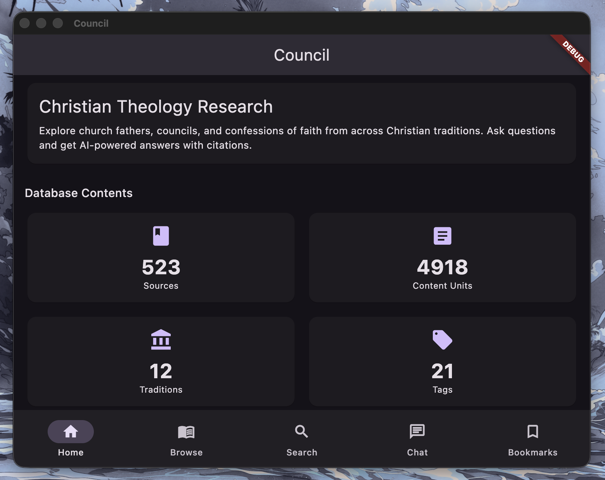

# Council

A Flutter app for offline Christian theology research, powered by local AI via Ollama.



## Features

- Browse 523 sources across 12 Christian traditions
- Full-text search across 4,918 content units
- AI-powered Q&A with citations, running locally via Ollama
- Bookmark passages for later reference

## Getting Started

Requires [Flutter](https://flutter.dev/) and [Ollama](https://ollama.com/) running locally.

```
flutter run -d macos
```
